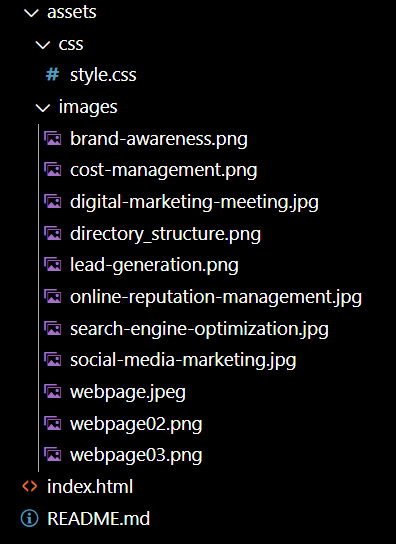

# GT-Coding Bootcamp -- HTML CSS Git: Code Refactor

## Table of Contents

1. About This Task
2. Directory Structure
3. Links to deployed application
4. Web Page Appearance

## 1. About This Task

One of the most common tasks for front-end and junior developers is to take existing code and refactor it (recall that to refactor code is to improve it without changing what it does) to meet a certain set of standards or implement a new technology. In this homework, a marketing agency has hired you to refactor an existing site to make it more accessible.

Web accessibility is an increasingly important consideration for businesses. It ensures that people with disabilities can access a website using assistive technologies such as video captions, screen readers, and braille keyboards. Making a website accessible is also good for business for many reasons, one of them being that accessible sites are better positioned in search engines like Google. It also helps companies avoid litigation that can occur when people with disabilities cannot access their website.

Even though accessibility is a broad topic that can include complex requirements, your tech lead has given you a small list of specific criteria to satisfy the project. These criteria are documented below in the Acceptance Criteria.

**Important**: An important rule to follow when working with someone else's code is the **Scout Rule**, which recommends that you always leave the code a little cleaner than when you found it.

To impress clients, you should always go the extra mile and improve the codebase for long-term sustainability. For example, make sure that all links are functioning correctly. Also, rework the CSS to make it more efficient by consolidating CSS selectors and properties, organizing them to follow the semantic structure of the HTML elements, and including comments before each element or section of the page.

Are you ready to jump in? Here are this week's homework requirements:

## 2. Directory Structure
Feel free to ignore the Develop directory and its contents. I left it there just in case it is a requirement for this work.

## 3. Links to deployed application
[title](https://github.com/willielibet/gt-bootcamp-html-css-code-refactor.git)

[title](https://willielibet.github.io/gt-bootcamp-html-css-code-refactor/)

## 4. Web Page Appearance

